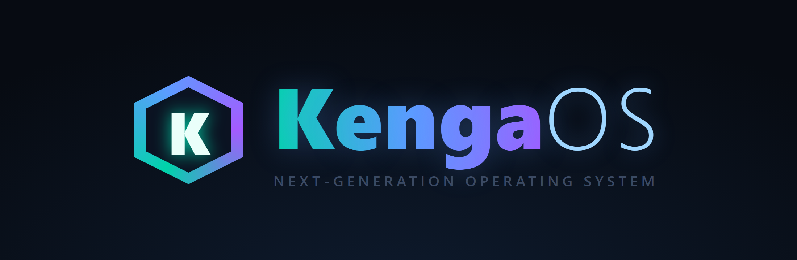
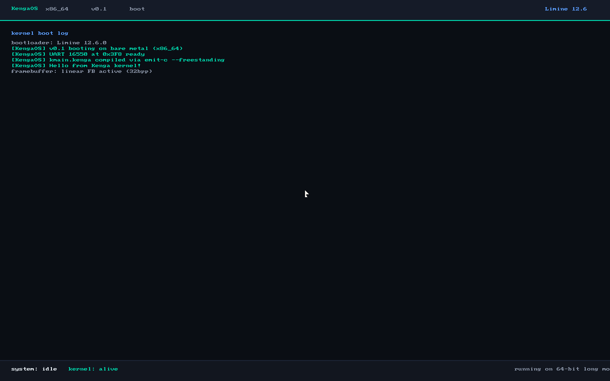
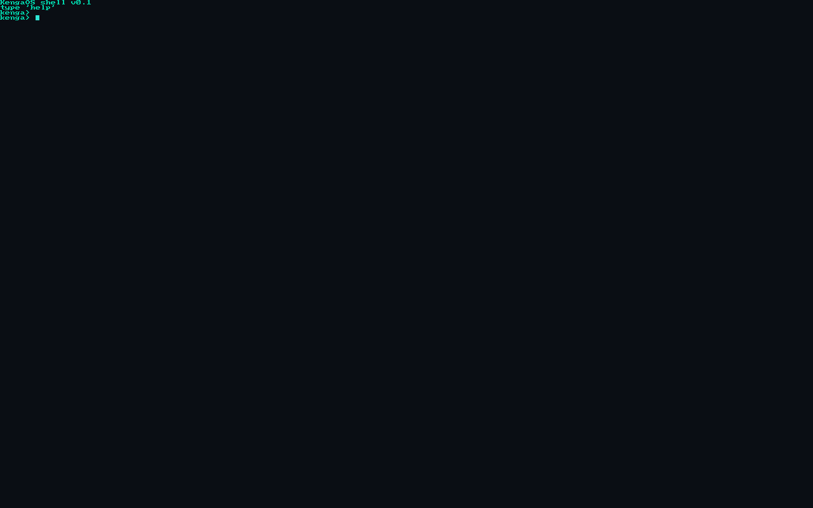
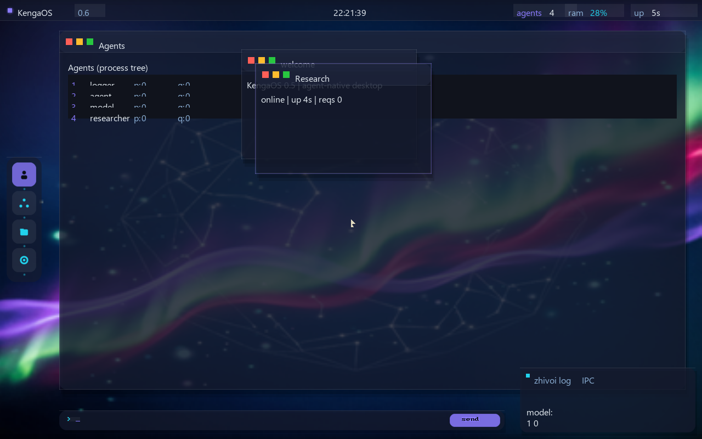

# KengaOS

<p align="center">
  
</p>

<p align="center">
  <strong>KengaOS</strong> — операционная система нового поколения<br/>
  <em>64-битное ядро на языке Kenga для x86_64</em>
</p>

<p align="center">
  <a href="https://github.com/GermannM3/KengaOS/actions/workflows/ci.yml">
    
  </a>
  <a href="https://github.com/GermannM3/KengaOS/actions/workflows/release.yml">
    
  </a>
  <a href="LICENSE">
    
  </a>
  <a href="https://github.com/GermannM3/kenga-lang">
    
  </a>
</p>

---

## О проекте

**KengaOS** — операционная система нового поколения, написанная на системном языке [Kenga](https://github.com/GermannM3/kenga-lang). Ядро (кроме точки входа на ассемблере и нескольких FFI-стабов) написано на Kenga и компилируется в freestanding C через `kenga emit-c --freestanding`. Загрузка — через [Limine](https://limine-bootloader.org).

Возможности:
- 64-битное ядро (x86_64, long mode, HHDM higher-half)
- Графический вывод через линейный framebuffer (1280×800+)
- PS/2 клавиатура и мышь
- Многозадачность с round-robin планировщиком
- Процессы и IPC (send/recv)
- Kernel heap из физической памяти
- Обработка исключений и panic
- Интерактивный shell
- CI/CD для ISO и 7 toolchain-таргетов

---

## Быстрый старт

```bash
git clone --recursive https://github.com/GermannM3/KengaOS.git
cd KengaOS
./scripts/build.sh          # Linux / macOS
scripts\build.cmd           # Windows (MSYS2 / Git Bash)
```

Запуск в QEMU:

```bash
qemu-system-x86_64 -M q35 -cdrom build/kengaos.iso -m 256M \
  -device usb-tablet -serial stdio
```

Параметр `-device usb-tablet` обязателен для полноценной мыши в desktop:
KengaOS получает абсолютные координаты курсора через USB-tablet, поэтому окна
можно перетаскивать без захвата мыши окном QEMU.

---

## Скриншоты

Экран загрузки ядра (linear framebuffer, рисуется ядром на Kenga):



Интерактивный shell (PS/2 клавиатура → framebuffer-консоль):



Agent-native десктоп KengaOS 0.6 Command Center (десктоп и логика на Kenga):



Скриншот выше снят непосредственно из собранного ISO в QEMU через
framebuffer monitor, а не из HTML-preview.

### Визуальное направление

Десктоп закреплён в стиле Aurora / glassmorphism: глубокий космический фон,
фиолетово-циановые свечения и единый Command Center с агентским графом,
телеметрией и рабочей строкой IPC. Старые плавающие окна и dock убраны из
основной композиции. В качестве визуального ориентира
используется [`docs/ui-reference-primer.jpg`](docs/ui-reference-primer.jpg),
а текущий рабочий результат показан на [`docs/desktop.png`](docs/desktop.png).

Standalone HTML-preview дизайн-системы находится в
[`docs/desktop-preview.html`](docs/desktop-preview.html) и открывается обычным
браузером без сборки ядра.

Управление desktop:

- `1–4` — Agents, Model, Files, System;
- `5` — Terminal;
- мышь — выбор dock, перетаскивание окон и изменение z-order;
- кнопка `x` — закрытие окна;
- нижний input-bar — отправка сообщения активному агенту через IPC.

---

## Возможности

| Компонент | Статус | Описание |
|---|---|---|
| Загрузчик | есть | Limine 12.6.0, `.limine_requests` |
| Архитектура | есть | 64-бит long mode + HHDM |
| UART 16550 | есть | Порт ввода-вывода (не MMIO) |
| Видео | есть | Linear framebuffer + 8×8 шрифт |
| Мышь (PS/2) | есть | Polling 0x60/0x64, XOR-курсор |
| GDT + IDT | есть | Исключения + panic (UART + framebuffer) |
| Планировщик | есть | Round-robin multitasking, собственные стеки |
| Клавиатура (PS/2) | есть | IRQ1, ring buffer, framebuffer-консоль |
| Shell | есть | `help`, `info`, `ver`, `clear`, `echo`, `mem`, `ps`, `agents`, `log`, `ask`, `spawn`, `tasks`, `ls`, `cat`, `time`, `cpuinfo`, `date`, `mmap`, `demo`, `reboot`, `poweroff` |
| Кириллица | есть | UTF-8 консоль + русский шрифт, русское приветствие |
| Память | есть | Kernel heap + frame-аллокатор (bitmap, ~94 МБ фреймов) |
| Процессы + IPC | есть | `k_proc_spawn`, `k_ipc_send`/`k_ipc_recv`, очереди сообщений |
| Kenga-agent | есть | Агент — системная сущность: `spawn` (создаёт агентов, рекурсивно), живая память (`remember`/`recall`), capability-права с наследованием, русский ответ |
| Agent-native модель | есть | Дерево процессов: `init` → системные агенты → пользовательские агенты (parent tracking) |
| **Model Agent** | есть | Настоящая нейросеть (MLP, XOR) как системный процесс: `model a b` → предсказание через IPC + `CAP_MODEL_INFER` |
| **GUI Desktop** | есть | Agent-native графическая среда, написана на Kenga (desktop.kenga): сайдбар (Agents/Model/Files/System), верхняя/статус панели, init-экран → desktop, живой рефрешь (часы RTC, uptime, RAM-бар), клавиатурное управление (1–4) |
| **Окна (CAP_UI)** | есть | Агенты с `CAP_UI` могут создавать окна через IPC (`ui <title>|<text>`); основной Command Center не создаёт legacy floating windows |
| **Agent chat** | есть | Клавиатурный ввод в input-бар → IPC агенту → ответ в собственном окне агента |
| **Живой лог** | есть | Панель событий агентов (IPC-трафик) над input-баром |
| VFS + initrd | есть | Виртуальная ФС + initrd через Limine (git-лог, инфо хоста) |
| Таймер / uptime | есть | PIT 100 Гц, команда `time` |
| Аппаратура | есть | CPUID (`cpuinfo`), RTC (`date`), память (`mmap`) |
| Power | есть | `reboot`, `poweroff` |
| CI/CD | есть | Автосборка ISO + QEMU smoke-тест с проверкой boot, VFS и IPC round-trip |
| Developer preview | готовится | Рабочий x86_64 ISO; paging-изоляция, сеть и persistent storage ещё в roadmap |

---

## Дорожная карта

Фаза 2 — прерывания и планировщик:
- PIT-таймер и регулярные IRQ
- Прерывный (timer-driven) планировщик (сейчас — кооперативный)
- Потоки и IPC-каналы

Фаза 3 — процессы и память (частично реализовано в developer-preview):
- Процессы с изоляцией адресного пространства (paging)
- Buddy-аллокатор для kernel heap
- Прерывный (timer-driven) планировщик
- Init daemon

Фаза 4+ — расширенный функционал:
- Сетевой стек (TCP/IP)
- Файловая система (FAT32 / ext2)
- Desktop environment с window manager
- Пакетный менеджер

---

## Сборка

Требования: C-компилятор (clang или gcc), линкер (`ld.lld` или GNU ld), `xorriso` (для ISO), QEMU (опционально). Компилятор Kenga подключается как git submodule.

```bash
./scripts/build.sh
```

Этапы:
1. Сборка компилятора Kenga (`cargo build --release`)
2. Эмиссия C-кода (`kenga emit-c --freestanding`)
3. Ассемблирование и компиляция (freestanding, без libc)
4. Линковка ELF (higher-half kernel)
5. Загрузка Limine 12.6.0 и создание ISO
6. Smoke-тест в QEMU (проверка UART-маркеров)
7. Готово — ISO для флешки или VM

---

## Структура репозитория

```
KengaOS/
├── kernel/                  # Ядро
│   ├── kmain.kenga         # Основной код (Kenga)
│   ├── desktop.kenga       # Desktop: event loop, окна, views (Kenga)
│   ├── ui.kenga            # Chrome десктопа: панели, sidebar (Kenga)
│   ├── start.S             # Точка входа (Assembly)
│   ├── kf_fb.c             # Framebuffer + консоль
│   ├── kf_kbd.c            # Клавиатура (PS/2)
│   ├── kf_mem.c            # Физическая память + heap
│   ├── kf_proc.c           # Процессы + IPC + окна (CAP_UI)
│   ├── kf_shell.c          # Интерактивный shell
│   ├── intr.c / isr.S      # GDT + IDT + обработчики
│   ├── sched.c             # Планировщик
│   ├── linker.ld           # Скрипт компоновщика
│   └── limine.cfg          # Конфигурация загрузчика
├── scripts/                # build.sh / build.cmd
├── docs/                   # Логотип и скриншоты
├── .github/workflows/      # CI + release
└── kenga-lang/             # Компилятор Kenga (submodule)
```

---

## Язык Kenga

**Kenga** — компактный строго типизированный системный язык для системного программирования:
- Семверный компилятор с чистым `emit-c` бэкендом (в т.ч. `--freestanding`)
- Встроенные интринсики для доступа к аппаратуре (`asm_inb/outb`, `mmio_read8/write8`)
- Атрибут `@intrinsic` для FFI
- Таргеты для Linux, macOS, Windows, Android, iOS

```kenga
@intrinsic fn asm_outb(port: i64, value: i64);

fn uart_write(c: i64) {
    asm_outb(0x3f8, c);
}
```

---

## Участие в проекте

### Установка на Windows-ноутбук

После успешной сборки релиза создайте переносимый пакет:

```powershell
python scripts/release_gate.py --build build
python scripts/package_windows_installer.py --build build
Expand-Archive dist/KengaOS-Installer-x86_64.zip -DestinationPath $env:TEMP\KengaOS-Installer
powershell -ExecutionPolicy Bypass -File $env:TEMP\KengaOS-Installer\scripts\install-kengaos.ps1 -Package $env:TEMP\KengaOS-Installer
```

Установщик проверяет SHA-256 всех артефактов и раскладывает релиз в отдельный слот с `active.json`. Это безопасный portable/deployment installer: он не форматирует диск и не заменяет загрузчик Windows. Bare-metal установка потребует отдельного подписанного загрузчика и проверенного сценария разметки диска.

KengaOS — активно развивающийся проект. Приветствуются:
- Отчеты об ошибках через Issues
- Предложения улучшений
- Code review и PR
- Улучшения документации

---

## Лицензия

[MIT](LICENSE) © [GermannM3](https://github.com/GermannM3)
