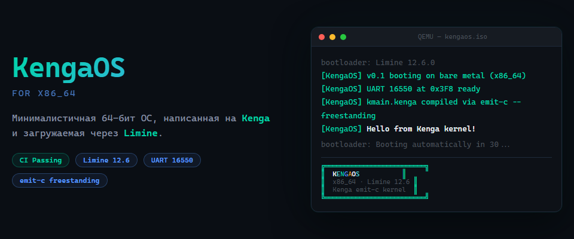

<p align="center">
  
</p>

<p align="center">
  <strong>KengaOS</strong> — минималистичная 64-бит ОС, написанная на языке <a href="https://github.com/GermannM3/kenga-lang">Kenga</a><br/>
  загрузка · UART · планировщик · ядро · x86_64
</p>

<p align="center">
  <a href="https://github.com/GermannM3/KengaOS/actions/workflows/ci.yml"></a>
  <a href="https://github.com/GermannM3/KengaOS/actions/workflows/release.yml"></a>
  <a href="LICENSE"></a>
  <a href="https://github.com/GermannM3/kenga-lang"></a>
</p>

---

## Для знакомых (30 секунд)

**KengaOS** — это хобби-операционная система, где весь ядроевой код (кроме точки входа на ассемблере и нескольких FFI-стабов) написан на языке Kenga и компилируется в freestanding C через `kenga emit-c --freestanding`.

### Быстрая сборка

```bash
git clone --recursive https://github.com/GermannM3/KengaOS.git
cd KengaOS
./scripts/build.sh          # Linux / macOS
scripts\build.cmd           # Windows (MSYS2 / Git Bash)
```

### Запуск в QEMU

```bash
qemu-system-x86_64 -M q35 -cdrom build/kengaos.iso -serial stdio
```

---

## Скриншот

Экран загрузки ядра (linear framebuffer 1280×800, рисуется самим ядром на Kenga):


---

## Что уже есть (M1)

| Возможность | Статус |
|---|---|
| Загрузка через **Limine 12.6.0** (stivale2-free, `.limine_requests` section) | ✅ |
| 64-бит long mode + HHDM higher-half mapping | ✅ |
| **UART 16550** — порты I/O (`asm_inb` / `asm_outb`), не mmio | ✅ |
| **Linear framebuffer** (Limine `framebuffer_request`) + 8×8 bitmap-шрифт | ✅ |
| **PS/2 мышь** (polling, порты 0x60/0x64) + курсор (XOR-рисование) | ✅ |
| Kernel-side `malloc` / `free` (bump-аллокатор, FFI в `kf_alloc.c`) | ✅ |
| Panic / oops handlers | ✅ |
| CI: сборка ISO + smoke-тест в QEMU (UART-маркеры) | ✅ |
| Release-пайплайн: **ISO + 7 toolchain-таргетов** (Linux, Windows, macOS × 2, Android × 2, iOS) | ✅ |

## Дорожная карта (M2+)

- **GDT / IDT / PIT** — таймер, прерывания и исключения
- **Превентивный планировщик** с потоками и IPC-каналами
- **Окна/панели** (композитор поверх фреймбуфера) + PS/2 клавиатура
- **GDT / IDT / PIT** — прерывания (IRQ для мыши/клавиатуры/таймера)
- Buddy/paging/syscalls
- Shell, init и агент-демон через IPC

---

## Сборка

Для сборки нужен C-тулчейн (clang или gcc), `ld.lld` (или GNU ld), `xorriso` и QEMU (опционально, для smoke-теста). На CI всё ставится автоматически.

Kenga-компилятор — git submodule, закреплён на конкретном коммите:

```bash
git clone --recursive https://github.com/GermannM3/KengaOS.git
cd KengaOS
```

`build.sh` / `build.cmd` выполняет 7 шагов:

1. Сборка компилятора Kenga (`cargo build --release`), если отсутствует
2. Компиляция `kmain.kenga` → C через `kenga emit-c --freestanding`
3. Ассемблирование и компиляция `start.S` / `kmain.c` / `kf_alloc.c` (freestanding, без libc)
4. Линковка `kengaos.elf` (higher-half, linker.ld)
5. Скачивание бинарников Limine 12.6.0 (если нужно) и сборка загружаемого `build/kengaos.iso`
6. Запуск в QEMU на несколько секунд и проверка UART-маркеров
7. Готово — ISO можно писать на флешку или грузить в любом VM

---

## Структура репозитория

```
kernel/            Исходники ядра (kmain.kenga, start.S, linker.ld, limine.cfg)
scripts/           build.sh / build.cmd — одна команда для сборки + QEMU smoke
docs/              Скриншоты и документация
.github/workflows/ CI + release-пайплайны
kenga-lang/        Компилятор Kenga (git submodule, закреплён)
```

---

## Язык Kenga

Kenga — компактный строго типизированный системный язык, компилирующийся в C. Ключевые идеи:

- Семверный компилятор с чистым emit-c бэкендом (`kenga emit-c --freestanding` для bare metal)
- Встроенные интринсики для доступа к аппаратуре: `asm_inb/outb`, `mmio_read8/write8`
- Атрибут `@intrinsic` для FFI-импорта/экспорта C-функций
- Таргеты для десктопа (Linux/macOS/Windows) и мобильных (Android/iOS)

---

## Лицензия

[MIT](LICENSE) © Kenga AI / [GermannM3](https://github.com/GermannM3)
