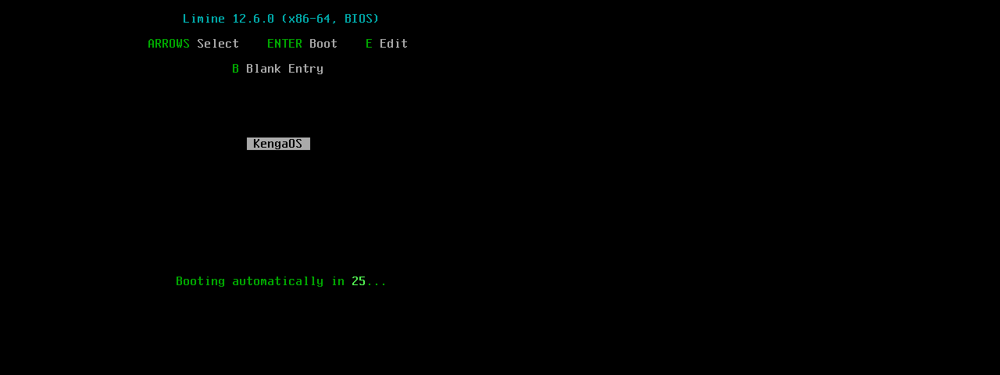

# KengaOS

```
 _  __                          ___  ____
| |/ /___  __ _ _ __ __ _  ___ / _ \/ ___|  ___
| ' // _ \/ _` | '__/ _` |/ _ \ | | \___ \ / _ \
| . \  __/ (_| | | | (_| |  __/ |_| |___) | (_) |
|_|\_\___|\__,_|_|  \__,_|\___|\___/|____/ \___/
```

A tiny 64-bit hobby OS for x86_64, written in [Kenga](https://github.com/GermannM3/kenga-lang) and booted with [Limine](https://limine-bootloader.org).

The whole kernel — except the assembly entry point and a few FFI stubs — is written in the Kenga programming language and compiled to freestanding C via `kenga emit-c --freestanding`.

[](https://github.com/GermannM3/KengaOS/actions/workflows/ci.yml)
[](https://github.com/GermannM3/KengaOS/actions/workflows/release.yml)

## Screenshot

Boot menu (Limine + KengaOS entry):



Kernel boot log over UART 16550 (COM1, 115200 8N1):

```
bootloader: Limine 12.6.0
[KengaOS] v0.1 booting on bare metal (x86_64)
[KengaOS] UART 16550 at 0x3F8 ready
[KengaOS] kmain.kenga compiled via emit-c --freestanding
[KengaOS] Hello from Kenga kernel!
```

## Status

Phase 1 (M1) is done: the kernel loads via Limine and talks over UART. A graphical framebuffer console and the rest of the roadmap are in progress.

**Done (M1)**
- Limine 12.6.0 boot protocol (stivale2-free, `.limine_requests` section)
- 64-bit long mode + HHDM higher-half mapping
- UART 16550 driver in pure Kenga (port I/O via `asm_inb` / `asm_outb` intrinsics)
- Kernel-side `malloc` / `free` (bump allocator, FFI into `kf_alloc.c`)
- Kernel panic / oops handlers
- CI: builds the ISO and smoke-tests it in QEMU (UART marker gate)

**Roadmap (M2+)**
- GDT / IDT / PIT (timer), interrupts and exceptions
- Preemptive scheduler with threads and IPC channels
- Framebuffer console + PS/2 keyboard driver (real on-screen output)
- Buddy/allocator upgrades, paging and syscalls
- Shell, init, and an agent daemon over IPC

## Repository layout

```
kernel/            Kenga kernel sources (kmain.kenga, start.S, linker.ld, limine.cfg)
scripts/           build.sh / build.cmd — one-command build + QEMU smoke test
docs/              screenshots and docs
.github/workflows/ CI + release pipelines
kenga-lang/        the Kenga compiler (git submodule, pinned)
```

## Building

Prerequisites: a C toolchain (clang or gcc), `ld.lld` or GNU ld, `xorriso`, and QEMU (optional, for the smoke test). On CI these are installed automatically.

The kenga compiler is a pinned git submodule. Clone with submodules:

```sh
git clone --recursive https://github.com/GermannM3/KengaOS.git
cd KengaOS
```

Then build the ISO and run the QEMU smoke test:

```sh
./scripts/build.sh          # Linux / macOS
scripts\build.cmd           # Windows (MSYS2/Git Bash)
```

`build.sh` will:
1. Build the kenga compiler (`cargo build --release`) if it is missing;
2. Compile `kmain.kenga` → C via `kenga emit-c --freestanding`;
3. Assemble and compile `start.S` / `kmain.c` / `kf_alloc.c` (freestanding, no libc);
4. Link `kengaos.elf` (higher-half, linker.ld);
5. Download Limine 12.6.0 binaries if needed and build a bootable `build/kengaos.iso`;
6. Boot it in QEMU for a few seconds and verify the UART boot markers.

## Running

```sh
qemu-system-x86_64 -M q35 -cdrom build/kengaos.iso -serial stdio
```

Or write `build/kengaos.iso` to a USB stick / boot it in any VM that supports BIOS boot.

## The Kenga language

Kenga is a small, strongly typed systems language that compiles to C. Key ideas:

- Semver-ed compiler with a clean emit-c backend (`kenga emit-c --freestanding` for bare metal).
- Built-in intrinsics for hardware access: `asm_inb/outb`, `mmio_read8/write8` and friends.
- `@intrinsic` FFI attribute to import/expose C functions (kernel allocators, `kf_*` runtime).
- Target tiers for desktop (Linux/macOS/Windows) and mobile (Android/iOS).

## License

MIT — see [LICENSE](LICENSE). Kenga itself is [MIT](https://github.com/GermannM3/kenga-lang).